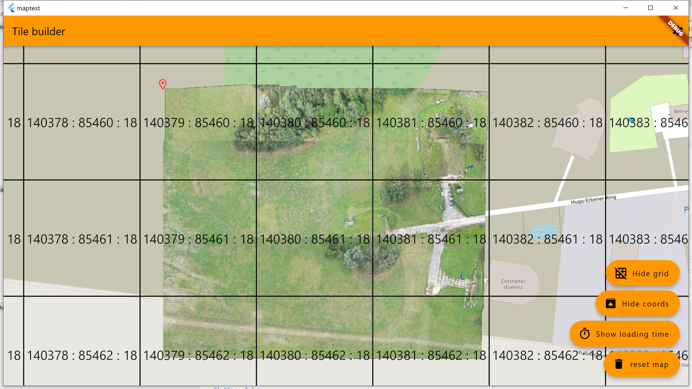
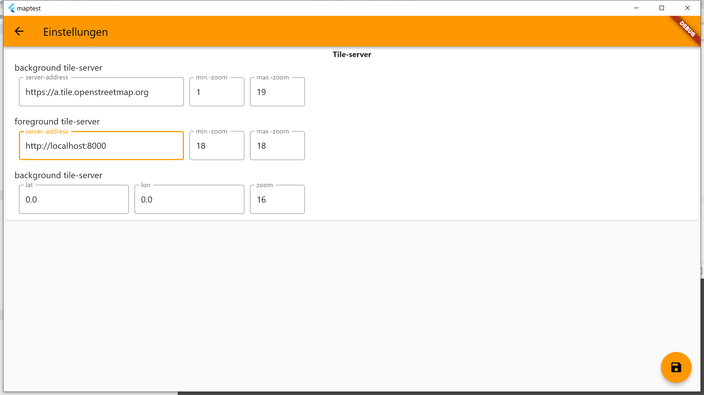

# map-test

* A small flutter program to test/debug xyz map layer APIs.
* Overlays two different map layers and shows the xyz coordinates.

## OS

* should be running on: windows, linux, max, android, ios
* tested: windows

### install

all pre-builds are here: [releases](releases)

## screenshots

# credits

thank you [flutter_map](https://github.com/fleaflet/flutter_map) Team, for the amazing map library
